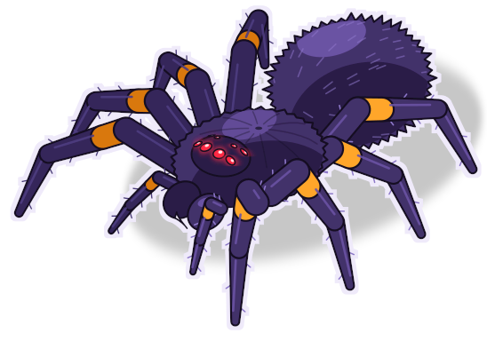
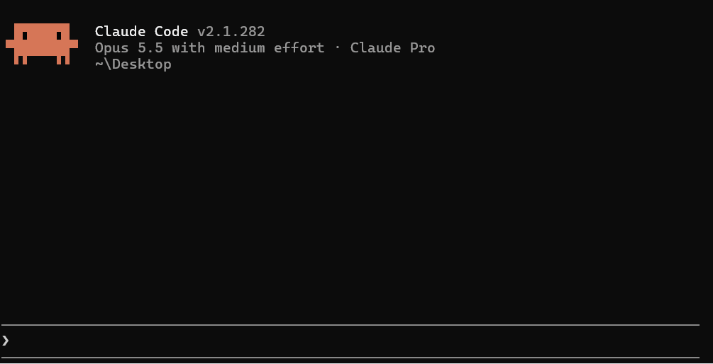
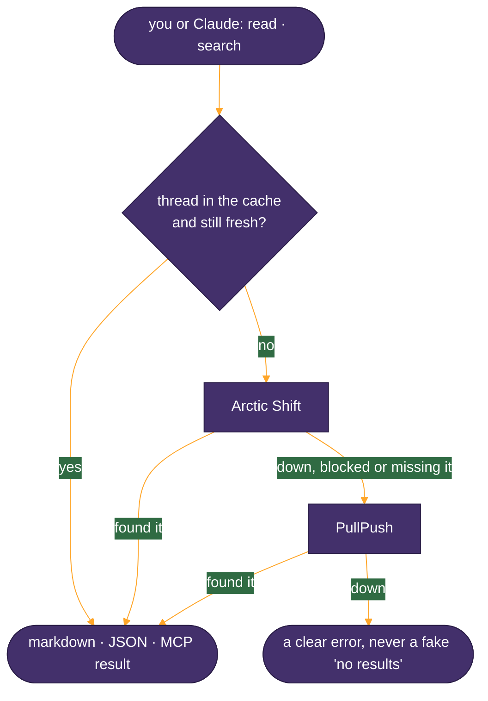

<p align="center">
  
</p>

<h1 align="center">tarantula</h1>

<p align="center">
  <b>Read Reddit from your terminal, or let Claude read it for you.</b><br>
  No Reddit API key, no browser, no scraping.
</p>

<p align="center">
  <a href="https://www.npmjs.com/package/tarantula-cli"></a>
  
  
  
  <a href="LICENSE"></a>
</p>

---

## The problem

I asked Claude to read a Reddit thread and it couldn't. Neither could anything else I tried.
Reddit blocks automated readers, and new access to its official API needs manual approval.
From a home connection, September 2026:

```console
$ curl https://www.reddit.com/r/<sub>/comments/<id>.json
403 Forbidden

$ curl -A "<a real browser's user agent>" https://www.reddit.com/r/<sub>/comments/<id>.json
403 Forbidden

$ curl -A "<a real browser's user agent>" https://old.reddit.com/r/<sub>/comments/<id>
302 → /login/?reason=lor2

# a fresh headless Chromium (Playwright) opening the thread
"You've been blocked by network security."

$ curl https://r.jina.ai/https://www.reddit.com/r/<sub>/comments/<id>
200, but the body is the same block page
```

## The fix

Reddit posts and comments are already copied by public archives run by volunteers. Tarantula asks
them instead of Reddit.

It tries [Arctic Shift](https://github.com/ArthurHeitmann/arctic_shift) first and falls back to
[PullPush](https://pullpush.io). You get the thread back as clean markdown or JSON, in your
terminal, or as two tools Claude can call on its own.

<p align="center"><sub><b>~650 lines</b> · <b>0 dependencies</b> · <b>2 sources</b> · <b>2 MCP tools</b> · <b>10 tests</b></sub></p>

## Try it

```sh
npx tarantula-cli read https://www.reddit.com/r/<sub>/comments/<id>/...
npx tarantula-cli read https://redd.it/<id> --max 50          # first 50 comments
npx tarantula-cli search smallbusiness packaging --days 365    # posts in one subreddit
npx tarantula-cli read <link> --json                           # JSON instead of markdown
```

Needs Node 20 or newer. `npm i -g tarantula-cli` gives you a `tarantula` command that starts
faster than `npx`.

## Use it in Claude Code

```sh
claude mcp add --scope user tarantula -- npx -y tarantula-cli@latest mcp
```

Then just ask: *"search r/smallbusiness for posts about packaging costs this year and summarise
the top complaints."*

<p align="center"></p>

Claude gets two tools:

| Tool | Give it | Get back |
|---|---|---|
| `read_reddit_thread` | a thread link, comment link, share link or post id | the post and its comments |
| `search_reddit` | a subreddit and some keywords | the most-discussed matching posts, with links |

Keep the `@latest`, or `npx` keeps using whichever version it cached first. `claude mcp list`
should show `tarantula … ✔ Connected`. Any other MCP client can run the same command over stdio.

## How it works



Searches skip the cache and always ask the archives.

## What it promises

- **A down archive is reported as down.** It never turns an outage into "no results".
- **Reddit text is marked as untrusted.** Claude treats it as something to read, not instructions to follow.
- **It's polite to the archives.** Requests are paced per archive and it backs off when asked to.

<details>
<summary><b>The JSON format</b></summary>

`--json` prints this shape (schema 1). It only changes with a new `schema` number.

```json
{
  "schema": 1,
  "thread": { "platform": "reddit", "id": "t3_…", "kind": "post", "url": "…", "container": "…",
              "author": "…", "created_at": 0, "edited_at": null, "text": "…", "score": 0,
              "status": "live | deleted | removed", "title": "…", "comment_count": 0 },
  "comments": [ { "…same item fields…": "", "kind": "comment", "parent_id": "t3_… | t1_…", "replies": [] } ],
  "provenance": { "source": "arcticshift", "cached": false, "fetched_at": 0, "retrieved_at": 0 },
  "completeness": { "expected": 0, "received": 0, "collapsed": 0, "partial": false, "shown": 0, "truncated": false },
  "focus": "t1_… | null"
}
```

More detail in [ARCHITECTURE.md](ARCHITECTURE.md).
</details>

## Things to know

- **These are archived copies.** Scores are usually stale, threads from the last few hours may be
  missing, and a copy can include text its author later deleted on Reddit.
- **Search needs a subreddit, and busy ones can time out.** Retry, or narrow it with `--days`.
- **It's early.** Version 0.x, so details may still change.

## Credits

Tarantula only works because [Arctic Shift](https://github.com/ArthurHeitmann/arctic_shift) and
[PullPush](https://pullpush.io) keep public copies of Reddit, run by volunteers. Please go easy on
them. Not affiliated with Reddit.

MIT © S.M. Ishaq

<p align="center"></p>
